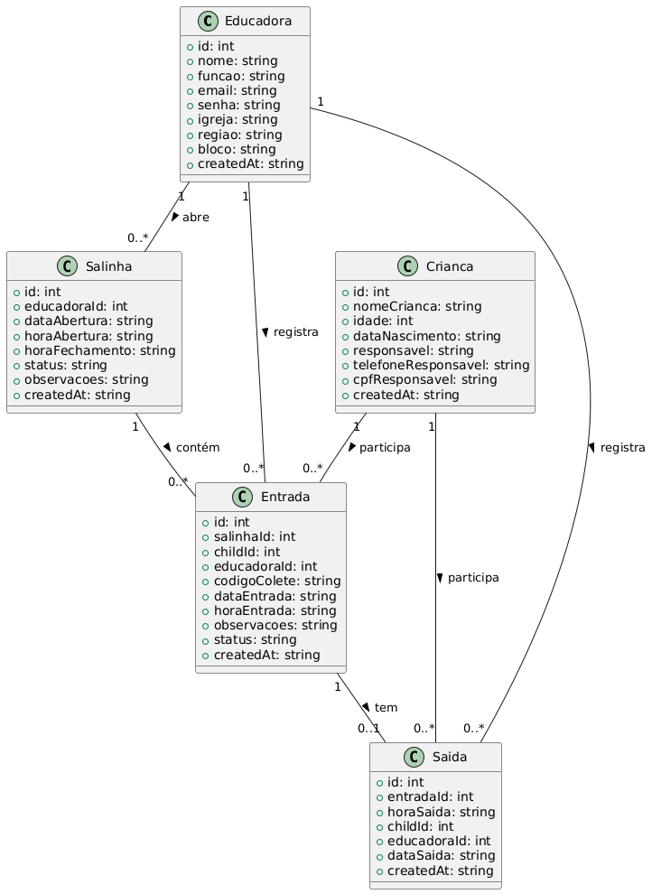

# Projeto EBI Mobile

Aplicativo mobile para gestão de salinhas, educadoras e crianças da EBI, desenvolvido em React Native com Expo, SQLite e arquitetura modular.

---

## 📁 Estrutura de Diretórios

```
projeto-ebi-mobile/
│
├── android/                  # Projeto nativo Android (Expo Bare/Dev Client)
├── ios/                      # Projeto nativo iOS (Expo Bare/Dev Client)
├── assets/                   # Imagens, fontes e outros recursos estáticos
├── src/
│   ├── app/                  # Telas principais do aplicativo (pages/screens)
│   │   ├── home.tsx
│   │   ├── sala.tsx
│   │   ├── cadastro-crianca.tsx
│   │   ├── entrada-crianca.tsx
│   │   ├── gerenciar-educadoras.tsx
│   │   ├── gerar-relatorio.tsx
│   │   └── ... (outras telas)
│   ├── components/           # Componentes reutilizáveis (botões, inputs, etc)
│   ├── hooks/                # Custom hooks (ex: use-permissions)
│   ├── services/             # Serviços de acesso a dados e lógica de negócio
│   │   └── sqliteService.ts
│   ├── styles/               # Estilos globais e específicos de telas
│   ├── types/                # Tipos e interfaces TypeScript
│   │   └── permissions.ts
│   └── utils/                # Funções utilitárias
│
├── package.json              # Dependências e scripts do projeto
├── app.json                  # Configuração do Expo
├── README.md                 # Documentação do projeto
└── ...                       # Outros arquivos de configuração
```

---

## 🗃️ Modelagem de Dados (UML)

Veja o diagrama de classes UML abaixo para entender as principais entidades e relações do sistema:



- **Educadora**: cadastra e gerencia salinhas e entradas.
- **Salinha**: representa uma sala aberta por uma educadora em um dia.
- **Criança**: participante das salinhas.
- **Entrada**: registro de presença da criança na salinha.
- **Saída**: registro de saída da criança da salinha.

---

## 🚀 Tecnologias Utilizadas

- **React Native** (Expo Bare/Dev Client)
- **Expo Router** (navegação)
- **SQLite** (`expo-sqlite` e `react-native-sqlite-storage`)
- **TypeScript**
- **React Hook Form** e **Yup** (validação de formulários)
- **Moment.js** e **date-fns** (datas)
- **react-native-html-to-pdf** (geração de relatórios PDF)
- **expo-sharing** (compartilhamento de arquivos)
- **react-native-document-picker** (acesso ao SAF)
- **Outros**: vector icons, mask-text, etc.

---

## ⚙️ Scripts Principais

- `npm start` ou `expo start` — Inicia o Metro Bundler
- `npm run android` — Executa no Android (Dev Client)
- `npm run ios` — Executa no iOS (Dev Client)
- `npm test` — Executa os testes unitários

---

## 📚 Como rodar o projeto

1. Instale as dependências:
   ```bash
   npm install
   ```
2. Instale o Dev Client:
   ```bash
   npx expo install expo-dev-client
   ```
3. Rode no Android:
   ```bash
   npx expo run:android
   ```
   Ou no iOS:
   ```bash
   npx expo run:ios
   ```

---

## 📝 Observações

- Para usar módulos nativos (ex: PDF, Document Picker), **NÃO use Expo Go**. Use sempre o Dev Client.
- O banco de dados é criado e migrado automaticamente na primeira execução.
- Permissões de armazenamento são solicitadas em tempo de execução para geração e compartilhamento de PDF.

---

## 📄 Licença

Este projeto é open-source e está sob a licença MIT.

---

> Dúvidas ou sugestões? Abra uma issue ou entre em contato com os mantenedores!